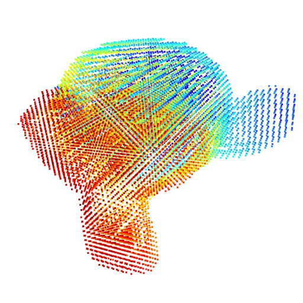
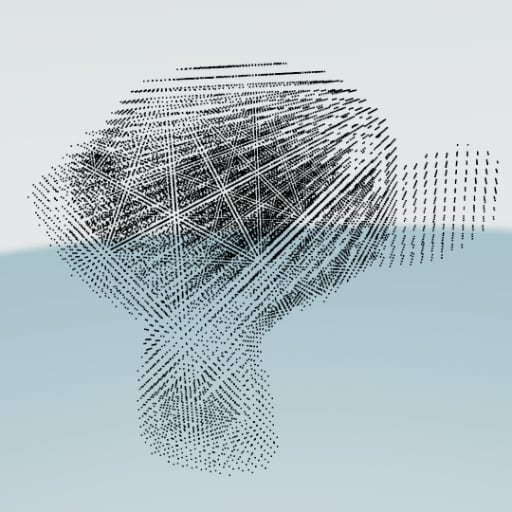

# Mesh voxelizer

_Header only mesh voxelizer in ANSI C_


**About**

Converts meshes and performs triangle-cube intersection to output a voxelized mesh.

**How to use**

Include the header only file as following once:

```c
#define VOXELIZER_IMPLEMENTATION
#include "voxelizer.h"
```

To generate a voxelized mesh, create an instance of `vx_mesh_t` and initialize its
vertices and indices like this:

```c
vx_mesh_t* mesh;
vx_mesh_t* result;
vx_point_cloud_t* pc;

mesh = vx_mesh_alloc(nvertices, nindices);

// Add vertices and indices from the original mesh you want to voxelize
// [...]

// Precision factor to reduce "holes" artifact
float precision = 0.01;

// Run voxelization
result = vx_voxelize(mesh, 0.025, 0.025, 0.025, precision, NULL);

// Make a point cloud for the voxel shell
pc = vx_voxelize_pc(mesh, 0.025, 0.025, 0.025, precision, NULL);

// Make a point cloud for the entire voxel volume (shell and interior voxels)
// Color information is not available for interior voxels.
float volume = 0.f;
pc = vx_voxelize_pc(mesh, 0.025, 0.025, 0.025, precision, &volume);

vx_point_cloud_free(pc);
vx_mesh_free(result);
vx_mesh_free(mesh);
```

**Integration tests**

```bash
mkdir build
cd build

# Release build
cmake -DCMAKE_BUILD_TYPE=Release ..

# Debug build
cmake -DCMAKE_BUILD_TYPE=Debug ..

# Build
make -j

# Change back to project directory
cd ..

# Run tests
./build/voxelizer-tests
```

* The Debug builds of the integration tests generate `.pcd` files (point clouds) in [`test/tmp`](test/tmp) for debugging
purposes. 
* The target `voxelizer-c99` is used to verify that the code compiles as C99. The tests themselves are compiled as C++.

**Viewing PCD files (Python script)**

View the point clouds generated by the integration tests with the provided Python script.

```bash
# Install requirements
pip install open3d

# View pcd files
python tools/view_pcd.py test/tmp/monkey_fill.pcd
python tools/view_pcd.py test/tmp/monkey_shell.pcd
```

The script displays 2 visualizations:




